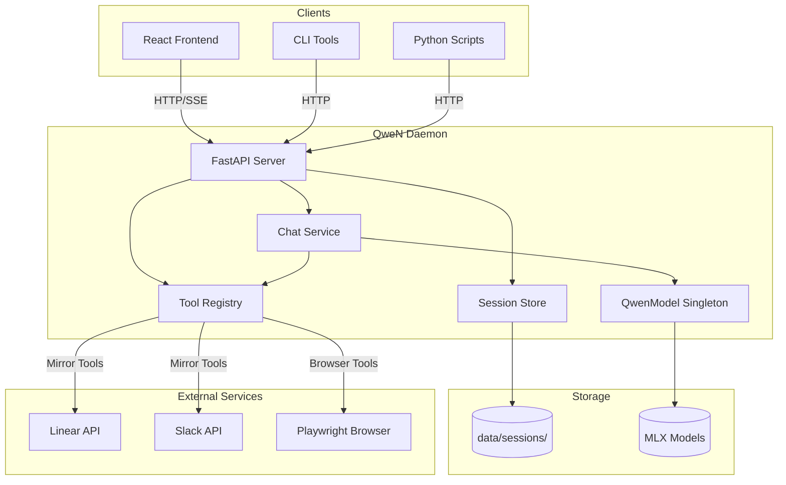
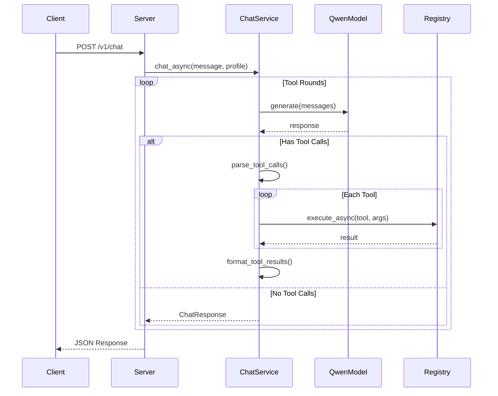
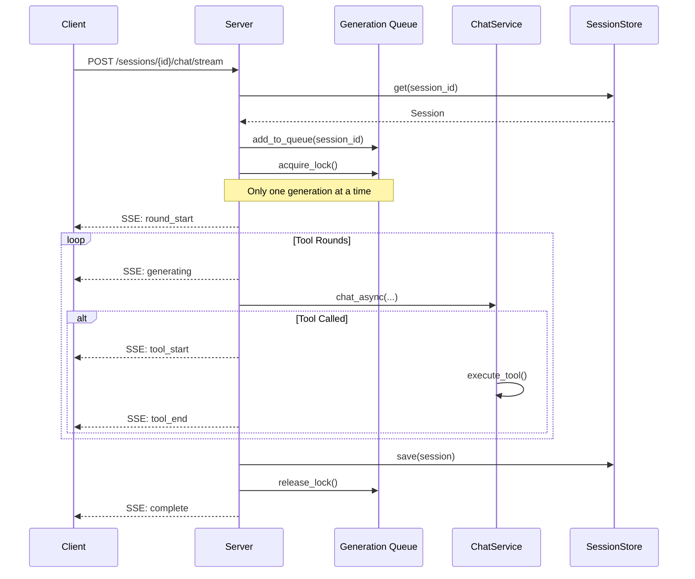
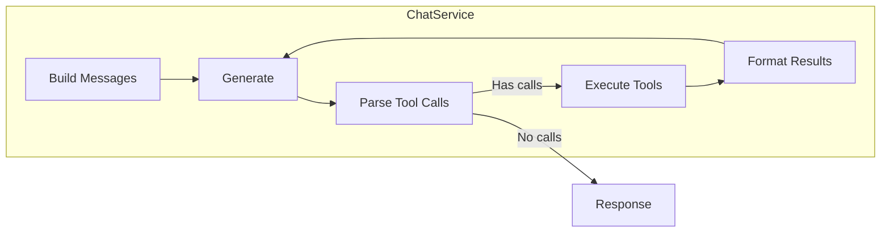
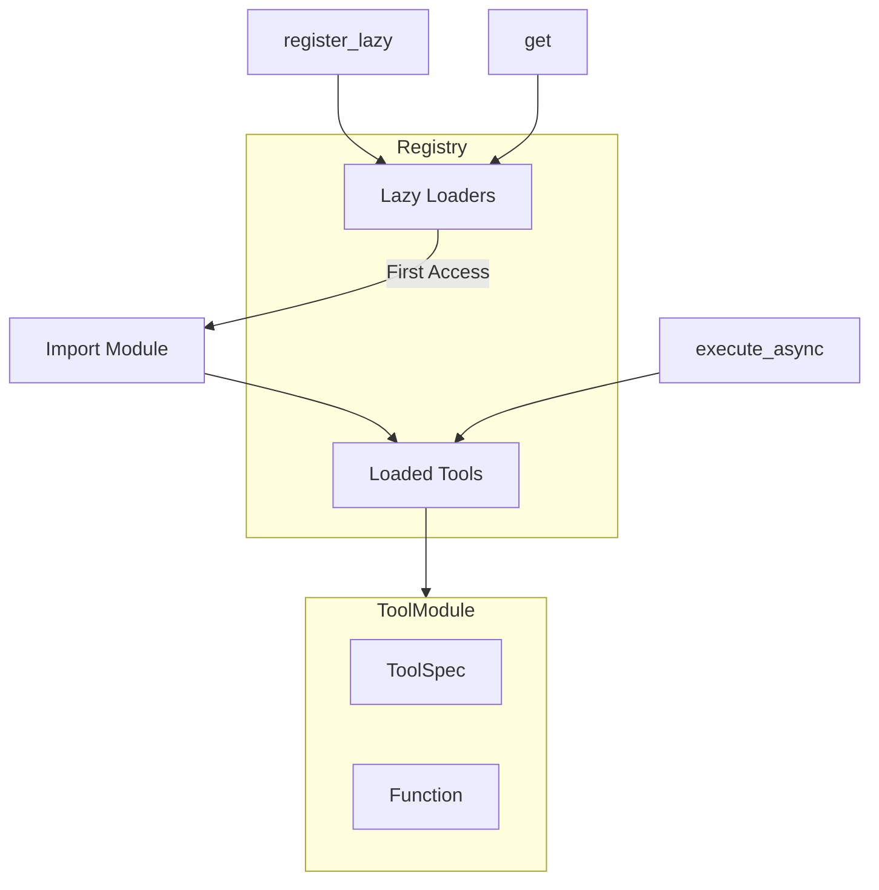
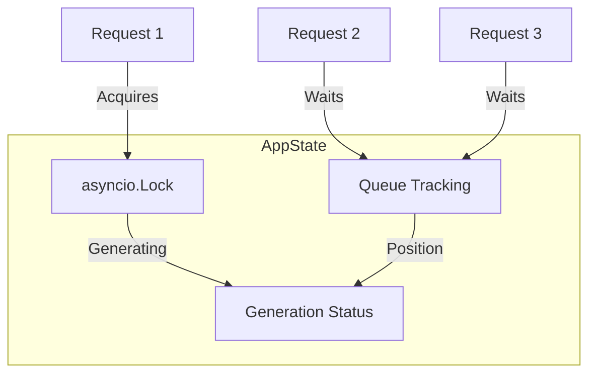
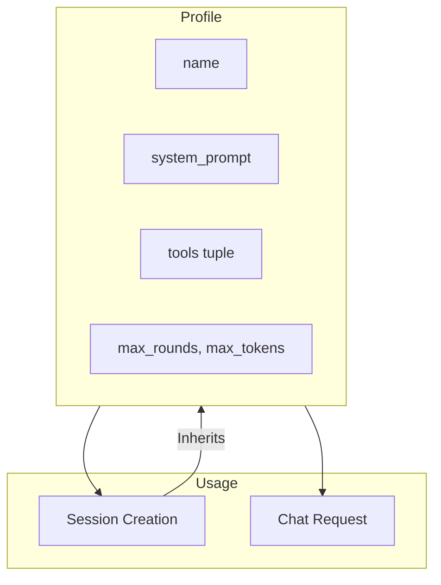
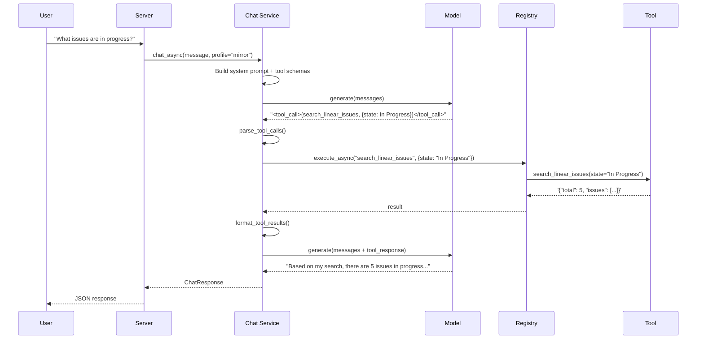
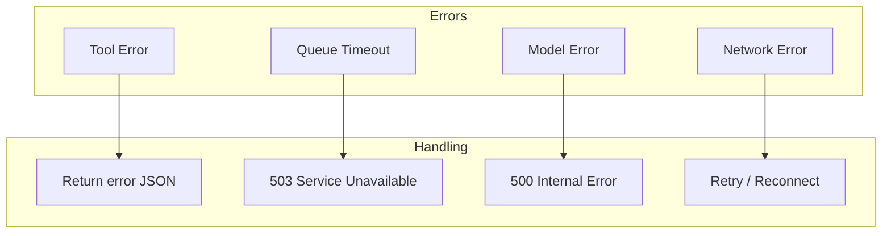

# Architecture

Internal design and data flow of the QweN Daemon.

## System Overview



## Request Flow

### Stateless Chat



### Session Chat with Streaming



## Component Details

### FastAPI Server (`daemon/server.py`)

The HTTP layer handling:

- Request validation via Pydantic models
- Route handlers for all endpoints
- SSE streaming for real-time events
- Application lifecycle (startup/shutdown)

### Chat Service (`daemon/chat.py`)

Orchestrates the conversation flow:



Key responsibilities:

- **Prompt Assembly**: Combines system prompt, history, and tool schemas
- **Generation**: Calls QwenModel with assembled messages
- **Tool Parsing**: Extracts `<tool_call>` blocks from responses
- **Tool Execution**: Invokes tools via registry
- **Result Injection**: Formats results as `<tool_response>` messages

### QwenModel Singleton (`daemon/chat.py`)

Manages the MLX model lifecycle:

```python
class QwenModel:
    _instance: QwenModel | None = None

    @classmethod
    def get_instance(cls, model_size: ModelSize) -> QwenModel:
        if cls._instance is None or cls._instance._model_size != model_size:
            cls._instance = cls(model_size)
        return cls._instance
```

- **Lazy Loading**: Model loaded on first inference
- **Singleton Pattern**: One model instance globally
- **Size Switching**: Can switch between small/medium/large

### Tool Registry (`daemon/tools/registry.py`)

Central registry for tool discovery and execution:



- **Lazy Loading**: Tools imported on first use
- **Async Support**: Handles both sync and async tool functions
- **Thread Safety**: Sync tools run in thread pool

### Session Store (`daemon/sessions.py`)

File-based persistence:

```
data/sessions/
├── session-abc123.json
├── session-def456.json
└── session-ghi789.json
```

Features:

- **Atomic Writes**: Via temp file + rename
- **Auto-pruning**: Empty sessions cleaned up
- **Sorted Listing**: Most recently updated first

## Generation Queue

The daemon enforces single-writer access to the model:



**Why single-writer?**

- MLX models aren't thread-safe for concurrent inference
- Memory constraints on Apple Silicon
- Predictable latency (no resource contention)

## Profile System



Profiles are immutable configurations that bundle:

- Agent persona (system prompt)
- Available tools
- Inference settings

## Tool Architecture

```mermaid
graph LR
    subgraph ToolModule
        Decorator[@tool decorator]
        Spec[ToolSpec]
        Func[Function]
        Export[TOOL export]
    end

    Decorator --> Spec
    Decorator --> Func
    Spec --> Export
    Func --> Export

    subgraph Registry
        LazyRef[Lazy Reference]
        Loaded[Loaded Tool]
    end

    Export -.->|register_lazy| LazyRef
    LazyRef -->|First Use| Loaded
```

Each tool module exports a `TOOL` constant combining schema and implementation:

```python
@tool(name="...", description="...", parameters={...})
def my_tool(arg: str) -> str:
    return json.dumps({...})

TOOL = my_tool  # Tool instance with spec + execute
```

## Data Flow: Tool-Using Query

Complete flow for a query that uses tools:



## Error Handling



- **Tool errors**: Caught and returned as JSON, LLM sees the error
- **Queue timeouts**: 503 after 30 minutes waiting
- **Model errors**: Logged and returned as 500
- **Network errors**: Client-side handling (retry, reconnect)

## Configuration

### Environment

The daemon reads configuration from:

1. Command-line args (`--host`, `--port`)
2. Default values in code

### Model Selection

```python
class ModelSize(Enum):
    SMALL = "mlx-community/Qwen2.5-7B-Instruct-4bit"
    MEDIUM = "mlx-community/Qwen2.5-14B-Instruct-4bit"
    LARGE = "mlx-community/Qwen3-32B-4bit"
```

Models are downloaded automatically on first use via Hugging Face Hub.

## Deployment

### Local Development

```bash
./run-daemon  # Starts on 127.0.0.1:5997
```

### Production Considerations

- **Single Instance**: No horizontal scaling (model in memory)
- **Memory**: 18GB+ for large model
- **Startup Time**: 30-60s for model loading
- **Persistence**: Session files require disk space
